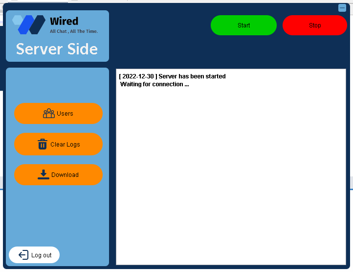

# Wired  


chat application using a centralized client/server model to provide multi-user functionality and server-level monitoring. The application was developed using Java programming language and the following technologies: JavaFX, JDBC, and MySQL. The editor used is Netbeans.

## How to Set Up and Configure

To run this program in NetBeans IDE, you can follow these steps:

- Fork and clone the repository or download it as a zip file and extract it to your local machine.
- Open NetBeans IDE and click on "File" in the menu bar.
- Select "Open Project" and navigate to the directory where you extracted the project.
- Select the project folder and click on the "Open Project" button to open it in NetBeans IDE.
- Once the project is opened, locate the main class file that contains the main method, which serves as the entry point of your application.
- Right-click on the main class file and select "Run File" from the context menu.
- NetBeans IDE will compile and run your Java application, and you should see the output in the "Output" pane.

### Client-side Configuration

Navigate to the Client directory exists at the JavaApplication/src and set the necessary variables in the ClientGUI file. Create your Mysql Database connection URL and ensure it's set as your url. Provide the following credentials:

```java

#  --- ClientGUI.java  ---
 String address = ""
 int port =

 url : "jdbc:mysql://localhost:3306/DB_NAME"
 user:      "USER_NAME"
 password: "PASSWORD"
```

### Database Configuration

* Install MySQL on your machine if you haven't already done so.
* Open the MySQL command-line interface or a MySQL GUI tool.
* Create a new database using the CREATE DATABASE command.
* Create the necessary database tables using the appropriate CREATE TABLE statements.
* Ensure that the MySQL server is running and accessible.


## Key Features

- User registration and login
- Multi threads based
- Multi user could be connected at the same time
- send and receive message
- send private messages to some client/s
- check the online users
- Watch trailers on YouTube
- Server dashboard to controle the community
- Logging the data
- connection between client/server and db/server.

## Technologies Used

### Frontend

- [JavaFX](#https://openjfx.io/): JavaFX is a software platform for creating and delivering desktop applications, as well as rich web applications that can run across a wide variety of devices
- [Netbeans IDE](#https://netbeans.apache.org/): NetBeans is an integrated development environment for Java
- [storyset](#https://storyset.com/): offers Free illustrations

### Backend

- [Java Threads](#https://www.java.com/en/): the thread in Java is the direction or path that is taken while a program is being executed. 


### Database

- [MySQL](#https://www.mysql.com): MySQL is an open-source relational database management system

### API

- [JDBC API](#https://www.oracle.com/database/technologies/appdev/jdbc-downloads.html): Java Database Connectivity (JDBC) is an application programming interface (API) for the Java programming language which defines how a client may access a database

## Demo

- Starting the server


* Creating two accounts. user1 & user2


* Loggin with the two accounts. user1 & user2


* Each user receive the new users logged in


* User can send messages then the others could receive it


* Also he can sends some private message to a specified user


* At the server side it can Control everything happening inside the server
check the users

download the logs

## Authors

- Github: (https://github.com/DCCXVII)
- Twitter: (https://twitter.com/0x_DCCXVII)
- Gmail: (dccxvii.inbox@gmail.com)

## License

MIT License

© 2023 DCCXVII

This software is provided under the MIT License, allowing any person to use, copy, modify, merge, publish, distribute, sublicense, and/or sell copies of the software, provided the original copyright notice and permission notice are included in all copies or substantial portions of the software. The software is provided "as is," without any warranty of any kind, and the authors or copyright holders will not be liable for any claims, damages, or other liabilities arising from the use of the software.
